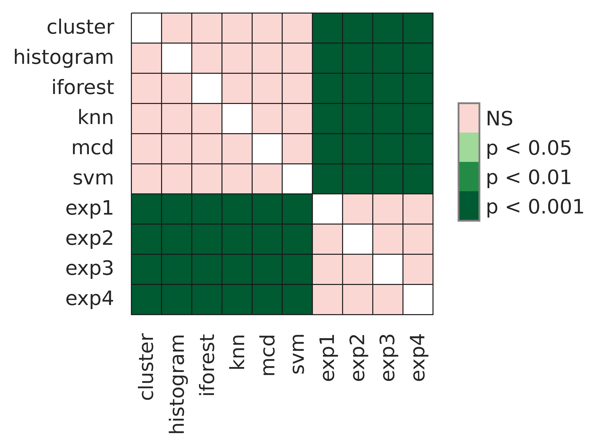
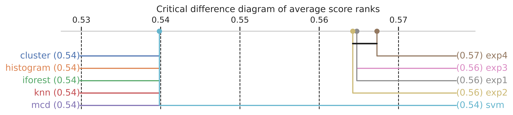
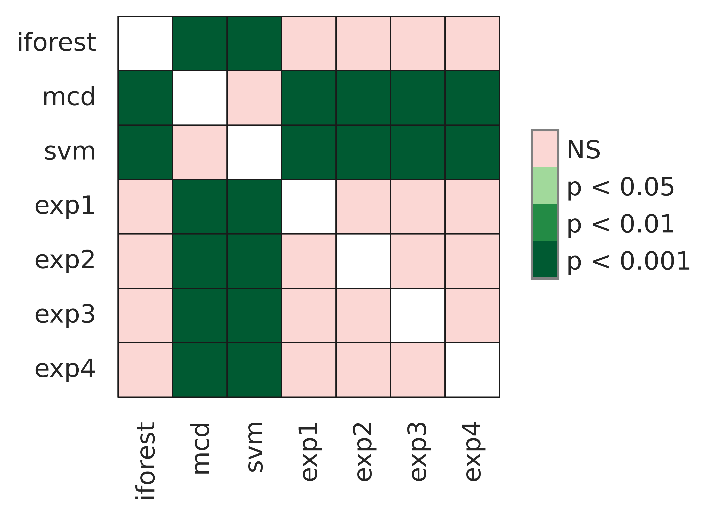
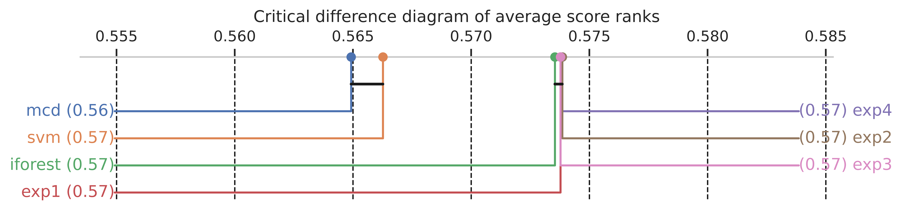

<h1 align="center">Anomaly Sensor Detection - IMS Bearing NASA Acoustics and Vibration Database</h1>

<h2 align="center">PyCaret vs Custom BiLSTM (Bidirectional LSTM)</h2>

## Introduction

This project will use four unsupervised anomaly detection models from Pycaret to detect anomalies in sensor-bearing vibration signals. These models are Decision Tree and Support Vector Machine. In addition, a customed LSTM model will be built using the PyTorch Framework to autoencode and decode the signal input. The data comprises three vibrational sensor readings from the NASA Acoustics and Vibration Database. The datasets contained text files with 1-second vibration signal snapshots (20,480 data points) recorded at 5 and 10 minutes intervals at a sampling rate of 20 kHz. 

•	Pycaret is a high-performance, open-source, low-code library for ML modelling. It provides highly-efficient CPU/GPU implementations of ML models for cluster analysis, classification, time series and anomaly detection. Snap ML accelerates ML algorithms through system awareness and offers novel ML algorithms with best-in-class accuracy. Pycaret also automates ML workflows and aims to democratise ML. For more information, please visit [Pycaret](https://pycaret.org/)[1]. 
•	PyTorch is a machine learning framework used for computer vision and natural language processing applications, initially developed by Meta AI and now part of the Linux Foundation umbrella. For more information, please visit [PyTorch](https://pytorch.org/).

Choi et al. conducted a study of the impact of deep Learning reported on anomaly detection in time-series data [7]. Several works on these datasets have been reported to prevent early anomalies successfully using deep learning architectures [2][3][4][5]. These works followed a semi-supervised approach to detecting failure. However, there is no strong rationale for selecting a specific train data subset. In addition, the models are not challenged against unseen data (another dataset from the three groups. Other studies have produced successful results but only used a tiny fraction of the data [5].

In this work, we will use deep learning architectures, a BiLSTM, to predict anomalies in an unsupervised fashion. The Autoencoder decoder will be trained in all datasets without separating the anomalies portion and evaluated on test dataset 3. In addition, Cluster, Histogram, iForest, KNN, MCD and SVM anomaly detection models will be trained and assessed on the same datasets. Further, the performance of the unsupervised models will be compared [6] using the nonparametric statistics Friedman test and the posthoc test Friedman-Conover.

The aim of this study is to determine whether PyCaret offers a similar or better performance than Artificial Neural Networks but at low code, therefore, optimising resources.

## Data
The data were sourced from [kaggle](https://www.kaggle.com/datasets/vinayak123tyagi/bearing-dataset) and comprises three datasets of vibrational sensor readings from the NASA Acoustics and Vibration Database. The datasets contained text files with 1-second vibration signal snapshots (20,480 data points) recorded at 5 and 10-minute intervals at a sampling rate of 20 kHz.

## Methods

### Experimental setup PyCaret Models

__Table 1__ Anomaly Models - PyCaret

|ID|Name|Reference|
|---|---|---|
|cluster|Clustering-Based Local Outlier|pyod\.models\.cblof\.CBLOF|
|iforest|Isolation Forest|pyod\.models\.iforest\.IForest|
|histogram|Histogram-based Outlier Detection|pyod\.models\.hbos\.HBOS|
|knn|K-Nearest Neighbors Detector|pyod\.models\.knn\.KNN|
|svm|One-class SVM detector|pyod\.models\.ocsvm\.OCSVM|
|mcd|Minimum Covariance Determinant|pyod\.models\.mcd\.MCD|

### Experimental Setup for BiLSTM

All experiments were run for 50 epochs, learning rate of 2 e-4 and a batch size of 32. The architecture used was a configurable Bidirectional-LSTM. For this work, only one layer with 32 hidden units and a dropout of 0.1 was used. The encoder-decoder can be customised to multiple BiLSTM layers.

__Table 2__ BILSTM Experiomental Setup Models
|Exp|Model|Loss|Optim|
|---|---|---|---|
|1|bilstm|mae\_loss|adam|
|2|bilstm|huber\_loss|adam|
|3|bilstm|mae\_loss|adamw|
|4|bilstm|huber\_loss|adamw|

The results from each model will be further analysed using cluster metrics three metrics, the silhouette coefficient, Calinski-Harabaz and Davies-Boulding indexes.

1. **Silhouette Score** is the mean Silhouette Coefficient for all clusters, which is calculated using the mean intra-cluster distance and the mean nearest-cluster distance. This score is between -1 and 1; the higher the score, the more well-defined and distinct the clusters are.

1. **Calinski-Harabaz Index** is calculated using the between-cluster and within-cluster dispersion to measure the distinctiveness between groups. Like the Silhouette Score, the higher the score, the more well-defined the clusters are. This score has no bound, meaning no ‘acceptable’ or ‘good’ value exists.

3. **Davies-Bouldin Index** is the average similarity of each cluster with its most similar cluster. Unlike the previous two metrics, this score measures the similarity of the clusters, meaning that the lower the score, the better the separation between the clusters. Zero is the lowest possible score. Values closer to zero indicate a better partition. The usage of centroid distance limits the distance metric to Euclidean space.

The disadvantage of the three metrics is that they generally score higher for convex clusters than other concepts of clusters. Therefore further compare their performance with **non-parametric statistics**.

## Results

Tables 3 and Figures 2-5 show the anomalies detected for each of the selected PyCaret and BiLST models for the training dataset and the independent test dataset.

__Table 3__: Anomalies detected by model for the training and test datasets.

| Model     | Anomalies -  training dataset | Anomalies-  Test dataset |
|-----------|:---------------------------------:|:----------------------------:|
| Cluster   |                50                 |              -               |
| Histogram |                50                 |              -               |
| iforest   |                50                 |             187              |
| KNN       |                50                 |              -               |
| MCD       |                50                 |              78              |
| SVM       |                50                 |              95              |
| Exp-01    |                99                 |             190              |
| Exp-02    |                98                 |             191              |
| Exp-03    |                99                 |             190              |
| Exp-04    |                104                |             191              |

### Training

*Cluster Metrics*

The models that obtained the highest Calinski-Harabasz and Davies-Bouldin indexes were SVM, MCV and Histogram. These models, in addition to IForest, showed the highest Silhouette scores (Table 4).

*Non-parametric Comparison*

* From the nonparametric statistical Conover-Friedman test, we found a significant difference in detecting anomalies among the models with 95 \% certainty.

* For the training dataset, there is no significant difference in the performance of each Pycaret model. However, all BiLSTM experiments differed significantly from all PyCaret models (Table 6, Figure 6). 
* All BiLSTM experiments were not significantly different from each other, as shown in the Friedman-Conover and critical difference diagrams. 
* Exp-04 ranked the highest scored but was not significantly different to __Exp-02__ to __Exp-04__. The anomaly could have been detected with 22:00 lead time with Exp-02 and Exp-04, while for the PyCaret models, the Clustering-Based Local outlier **cluster** could have detected the anomalies 14:40 hr in advance.

### Test

*Cluster Metrics*

MCD and SVM obtained the highest Silhouette scores and Calinski-Harabasz and Davies-Bouldin indexes (Table 5).

* From the nonparametric test, we can reject the null hypothesis that the performance of all models at detecting anomalies is not significantly different with 95% certainty

* The ranking of the models shows that the best model and the Conover-Friedman test and critical difference diagram showed no statistical difference amongst experiments Exp-01 to Exp-04 and iForest with 95% certainty (Table 6, Figure 7).
* Similarly, MCD and SVM showed no significant difference in detecting anomalies but significantly differed from all other models.

* Experiments Exp-02 and Exp-04 minimised which objective function to minimised was the Huber-Loss ranked the highest of all models.
* The Conover-Friedman test and critical difference diagram showed no statistical difference amongst experiments Exp-01 to Exp-04 and iForest.  
* Any of the BiLSTM models could have detected the anomaly within a 27:00 hr lead time, specifically Exp-03 within 27:20:00, while Iforest detected the anomalies within a lead time of 25:30:00.

### PyCaret

  Train dataset - Dataset 2 (avg_df2)

  

Figure 2. Anomalies detected by the PyCaret models on the training dataset.

Test dataset - Dataset 3 (avg_df3)

   

  Figure 3. Anomalies detected by the PyCaret models on the test dataset.

  
 
 

### BiLSTM - PyTorch

  
  Train dataset - Dataset 2 (avg_df2)

A B
C B

  Figure 4. Anomalies distribution detected on the training dataset. The experimental setup is outlined in Table 2. A. Exp-01, B.Exp-02, C. Exp-03, D.Exp-04

 
 

  Test dataset - Dataset 3 (avg_df3)

A B
C D

Figure 5. Anomalies distribution detected on the test dataset. The experimental setup is outlined in Table 2. A. Exp-01, B.Exp-02, C. Exp-03, D.Exp-04.

## Cluster Metrics

__Table 4__: Cluster metrics on the training dataset.
|index|silhoutte|calinski\_harabasz|davies\_bouldin|
|---|---|---|---|
|cluster|0\.7762|646\.9312|0\.8175|
|histogram|0\.8124|1001\.4351|0\.6754|
|iforest|0\.8124|992\.9829|0\.6791|
|knn|0\.8017|897\.689|0\.7167|
|mcd|0\.8124|1004\.5345|0\.6739|
|svm|0\.814|1011\.3661|0\.6723|
|exp1|0\.7442|879\.5458|0\.7615|
|exp2|0\.747|892\.5695|0\.7562|
|exp3|0\.7442|879\.5458|0\.7615|
|exp4|0\.7386|875\.7697|0\.764|

 
 0 is rejected.
* Posthoc- Friedman-Conover pairwise comparison
*  Critical Difference Diagram

Figure 6.  Figure 6. Conover-Friedman posthoc comparison training results and critical distance on the unseen test data by model.

 
 

## Test results

* Non-parametri test - Friedman-chisquare pvalue = 6.51e-19. Therefore the H0 is rejected.
* Posthoc- Friedman-Conover pairwise comparison
* Critical Difference Diagram

  

Figure 6. Conover-Friedman posthoc comparison test results and critical distance on the unseen test data by model.

# Conclusion
In summary, Exp-04 consistently obtained the best performance in both datasets. The test dataset was almost six times larger than the train set. It also presented spikes at the beginning and middle of the test. We can observe that the data's size and quality impact the model's choice to detect failures. Models Histogram, Cluster, and KNN were excluded in the test comparison since they accounted for more than 50% of the test dataset which is inaccurate as per the data visualisations. These models showed to be less robust for unseen data.

Conversely, the __IForest__ model took the lead in detecting anomalies together with Exp-01 and Exp-04 with no significant difference in their performance for the unseen test dataset. It showed to be __more robust__ to changes independently of dataset size and unknown contamination. 

We can conclude that the PyCaret Anomalies models selected in this work and the Bilstm (Bidirectional LSTM) Artificial Neural Networks can detect failures on the bearing sensors' signals at the same performance level. Whether these models can detect failures days or weeks in advance in other unseen data requires further testing and optimisation.

## References

[1] [PyCaret](https://pycaret.gitbook.io/docs/)
 
 
[2] https://towardsdatascience.com/lstm-autoencoder-for-anomaly-detection-e1f4f2ee7ccf
 
 
[3] https://towardsdatascience.com/machine-learning-for-anomaly-detection-and-condition-monitoring-d4614e7de770
 
 
[4] https://sabtainahmadml.medium.com/condition-monitoring-through-diagnosis-of-anomalies-lstm-based-unsupervised-ml-approach-5f0565735dff
 
 
[5] Zhang, R.; Peng, Z.; Wu, L.; Yao, B.; Guan, Y. Fault Diagnosis from Raw Sensor Data Using Deep Neural Networks Considering Temporal Coherence. Sensors 2017, 17, 549. https://doi.org/10.3390/s1703054
 
 
[6] Goldstein, M. and Uchida, S. (2016) ‘A comparative evaluation of unsupervised anomaly detection algorithms for multivariate data’, PLOS ONE, 11(4). doi:10.1371/journal.pone.0152173. 
 
 
[7] K. Choi, J. Yi, C. Park and S. Yoon, "Deep Learning for Anomaly Detection in Time-Series Data: Review, Analysis, and Guidelines," in IEEE Access, vol. 9, pp. 120043-120065, 2021, doi: 10.1109/ACCESS.2021.3107975.

