<h1 align="center">Anomaly Sensor Detection - IMS Bearing NASA Acoustics and Vibration Database</h1>

<h2 align="center">PyCaret vs Custom BiLSTM (Bidirectional LSTM)</h2>

## Introduction

This project will use four unsupervised anomaly detection models from Pycaret to detect anomalies in sensor-bearing vibration signals. These models are Decision Tree and Support Vector Machine. In addition, a customed LSTM model will be built using the PyTorch Framework to autoencode and decode the signal input. The data comprises three vibrational sensor readings from the NASA Acoustics and Vibration Database. The datasets contained text files with 1-second vibration signal snapshots (20,480 data points) recorded at 5 and 10 minutes intervals at a sampling rate of 20 kHz. 

•	Pycaret is a high-performance, open-source, low-code library for ML modelling. It provides highly-efficient CPU/GPU implementations of ML models for cluster analysis, classification, time series and anomaly detection. Snap ML accelerates ML algorithms through system awareness and offers novel ML algorithms with best-in-class accuracy. Pycaret also automates ML workflows and aims to democratise ML. For more information, please visit [Pycaret](https://pycaret.org/)[1]. 
•	PyTorch is a machine learning framework used for computer vision and natural language processing applications, initially developed by Meta AI and now part of the Linux Foundation umbrella. For more information, please visit [PyTorch](https://pytorch.org/).

Choi et al. conducted a study of the impact of deep Learning reported on anomaly detection in time-series data [7]. Several works on these datasets have been reported to prevent early anomalies successfully using deep learning architectures [2][3][4][5]. These works followed a semi-supervised approach to detecting failure. However, there is no strong rationale for selecting a specific train data subset. In addition, the models are not challenged against unseen data (another dataset from the three groups. Other studies have produced successful results but only used a tiny fraction of the data [5].

In this work, we will use deep learning architectures, a BiLSTM, to predict anomalies in an unsupervised fashion. The Autoencoder decoder will be trained in all datasets without separating the anomalies portion and evaluated on test dataset 3. In addition, Cluster, Histogram, iForest, KNN, MCD and SVM anomaly detection models will be trained and assessed on the same datasets. Further, the performance of the unsupervised models will be compared [6] using the nonparametric statistics Friedman test and the posthoc test Friedman-Conover.

The aim of this study is to determine whether PyCaret offers a similar or better performance than Artificial Neural Networks but at low code, therefore, optimising resources.

## Data
The data was source from [kaggle](https://www.kaggle.com/datasets/vinayak123tyagi/bearing-dataset) and comprises three datsets of vibrational sensor readings from the NASA Acoustics and Vibration Database. The datasets contained text files with 1-second vibration signal snapshots (20,480 data points) recorded at 5 and 10 minute intervals at a sampling rate of 20 kHz.

## Methodos

### Experimental setup PyCaret Models

__Table 1__ Anomaly Models - PyCaret

|ID|Name|Reference|
|---|---|---|
|cluster|Clustering-Based Local Outlier|pyod\.models\.cblof\.CBLOF|
|iforest|Isolation Forest|pyod\.models\.iforest\.IForest|
|histogram|Histogram-based Outlier Detection|pyod\.models\.hbos\.HBOS|
|knn|K-Nearest Neighbors Detector|pyod\.models\.knn\.KNN|
|svm|One-class SVM detector|pyod\.models\.ocsvm\.OCSVM|
|mcd|Minimum Covariance Determinant|pyod\.models\.mcd\.MCD|

### Experimental Setup for BiLSTM

All experiments were run for 200 epochs, learning rate of 2 e-4 and batch size of 32. The architecture use was a configurable Bidirectional-LSTM. For this work only one layer of size 32 was used. The encoder-decoder can be costumized to multiple bilstm layers.

__Table 2__ BILSTM Experiomental Setup Models
|Exp|Model|Loss|Optim|
|---|---|---|---|
|1|bilstm|mae\_loss|adam|
|2|bilstm|huber\_loss|adam|
|3|bilstm|mae\_loss|adamw|
|4|bilstm|huber\_loss|adamw|

## Results

__Table 3__: Anomalies detected by model in the training and test datasets

| Model     | Anomalies -  training dataset | Anomalies-  Test dataset |
|-----------|:---------------------------------:|:----------------------------:|
| Cluster   |                50                 |              -               |
| Histogram |                50                 |              -               |
| iforest   |                50                 |             187              |
| KNN       |                50                 |              -               |
| MCD       |                50                 |              78              |
| SVM       |                50                 |              95              |
| Exp-01    |                41                 |             197              |
| Exp-02    |                52                 |              75              |
| Exp-03    |                109                |             196              |
| Exp-04    |                74                 |             141              |

**Training**

* From the nonparametric statistical Friedman test, we found a significant difference in detecting anomalies among the models with 95 % certainty.

* For the training dataset, there is no significant difference in the performance of each of the
Pycaret models and experiments Exp-01 and Exp-02. We can infer with 95 % certainty that the Anomalies detected by each model occurred very close to the other.
*  __Exp-03__ was the most sensitive to anomalies, followed by Exp-04. Both experiments were significantly different to all PyCaret models and experiments Exp-01 and Exp-02. Experiments Exp-03 and Exp-04 were optimised with AdamW.
* Exp-03 ranked the highest of all models, followed by Exp-04.

* From the nonparametric test, we can reject the null hypothesis that the performance of all models at detecting anomalies is not significantly different with 95% certainty

* For the critical difference diagram and Friedman-Conover comparison, we can see that the iforest, Exp-01 and Exp-03 perform at the same level with 95 % certainty. Similarly, experiments Exp-02, MCD and SVM show no significant difference in detecting anomalies.

* Experiment Exp-01 and Exp-03 models used the mean absolute error as the objective to optimise.
* The ranking of the models shows that the best models to detect earlier anomalies on the test dataset are exp1, exp3 and iforest.
* Experiment Exp-04 performed differently from all models in the middle of the performance.

### PyCaret
#### Train dataset - Dataset 2 (avg_df2)

  

Figure 2. 

#### Test dataset - Dataset 3 (avg_df3)

  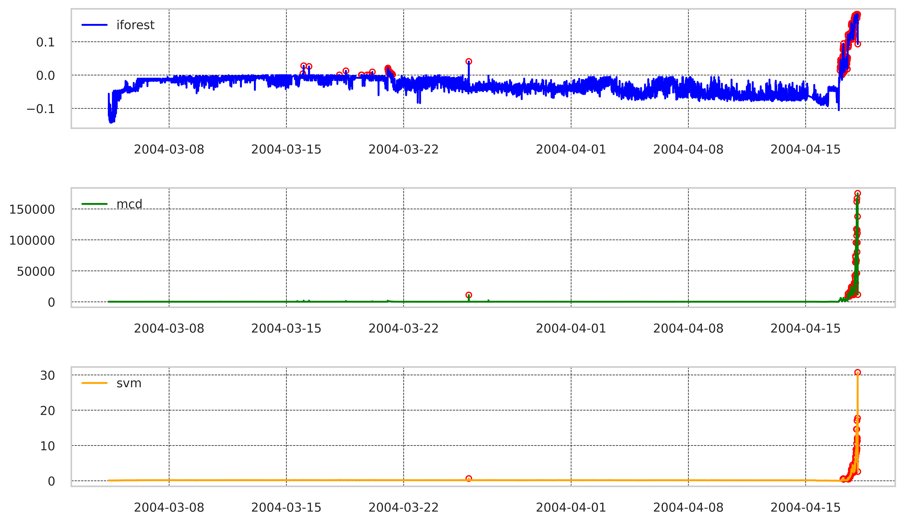 

  Figure 3. 

  
 
 

### BiLSTM - PyTorch

### Train dataset - Dataset 2 (avg_df2)

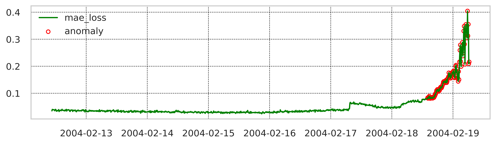A 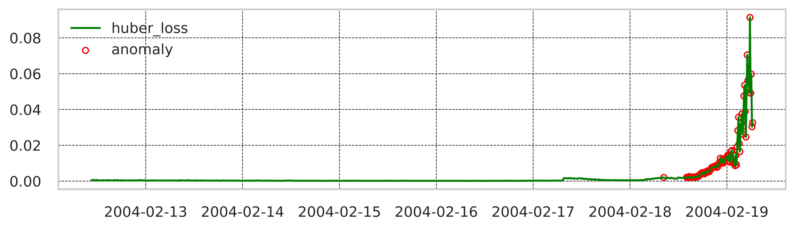B
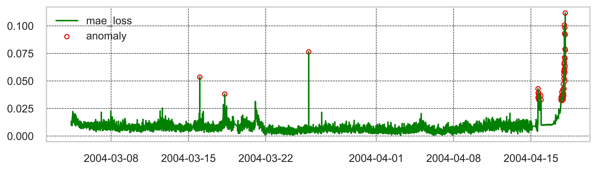C 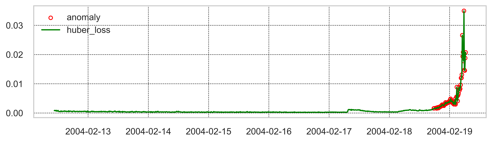B

  Figure 4. Anomalies distribution detected on the train dataset. The experimental setup is outlined in Table 2. A. Exp-01, B.Exp-02, C. Exp-03, D.Exp-04

 
 

### Test dataset - Dataset 3 (avg_df3)

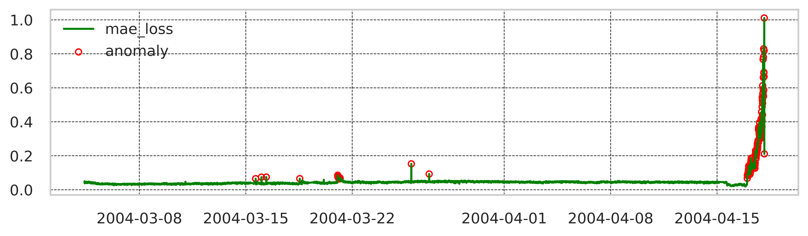A 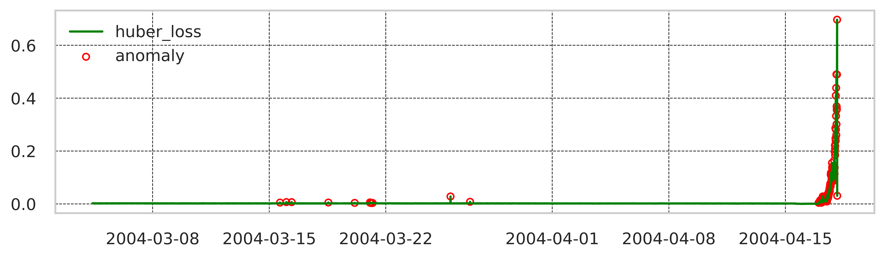B
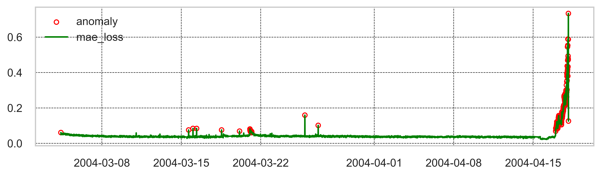C 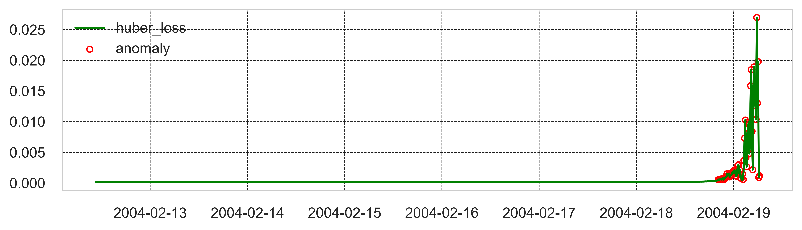D

Figure 5. Anomalies distribution detected on the test dataset. The experimental setup is outlined in Table 2. A. Exp-01, B.Exp-02, C. Exp-03, D.Exp-04.

## Nonparametric Statistical Models Comparison - Friedman-Conover

__Table 4__: Models performance ranking  for the training and test datasets.

| Model     | Training Ranks | Test Ranks |
|-----------|:--------------:|:----------:|
| Exp-01    |    0.541556    |  0.576059  |
| Exp-02    |    0.547154    |  0.566414  |
| Exp-03    |    0.576118    |  0.575980  |
| Exp-04    |    0.547154    |  0.571632  |
| Cluster   |    0.546138    |     -      |
| Histogram |    0.546138    |     -      |
| iForest   |    0.546138    |  0.575269  |
| KNN       |    0.546138    |     -      |
| MCD       |    0.546138    |  0.566651  |
| SVM       |    0.541565    |  0.567995  |

## Training results

* Friedman-chisquare non parametric statistical test - pvalue = 4.80e-48. Therefore the H0 is rejected.
* Posthoc- Friedman-Conover pairwise comparison
*  Critical Difference Diagram

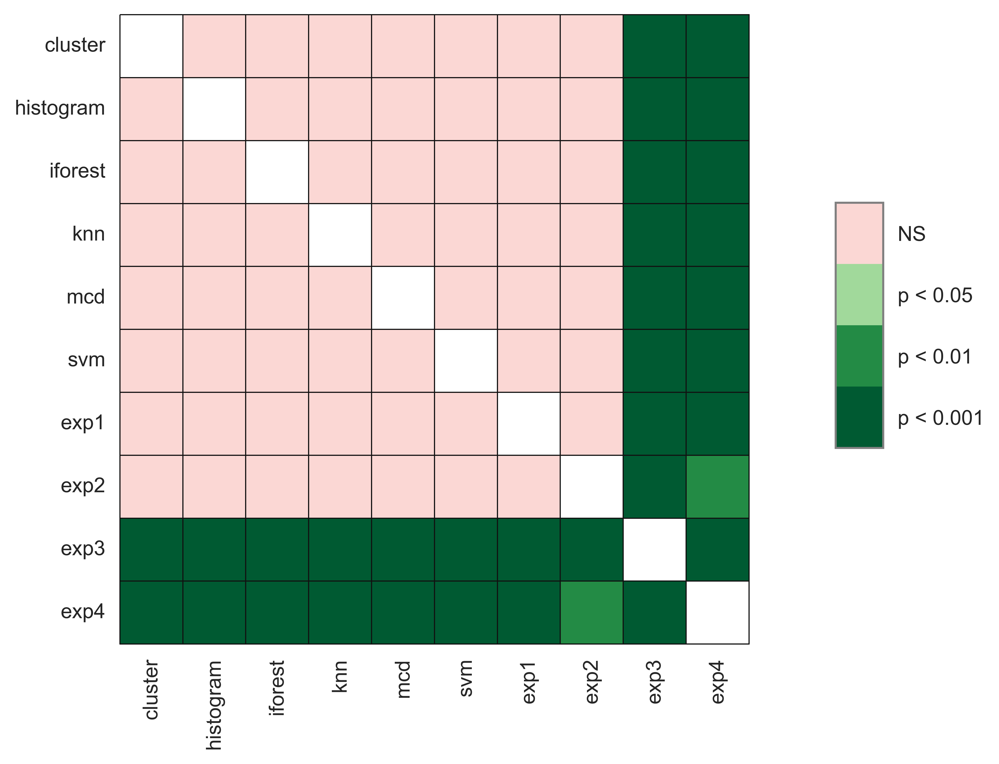

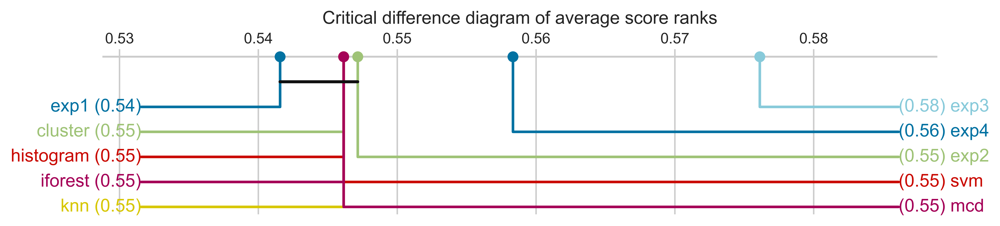

 
 

## Test results

* Non-parametri test - Friedman-chisquare pvalue = 9.21e-114. Therefore the H0 is rejected.
* Posthoc- Friedman-Conover pairwise comparison
* Critical Difference Diagram

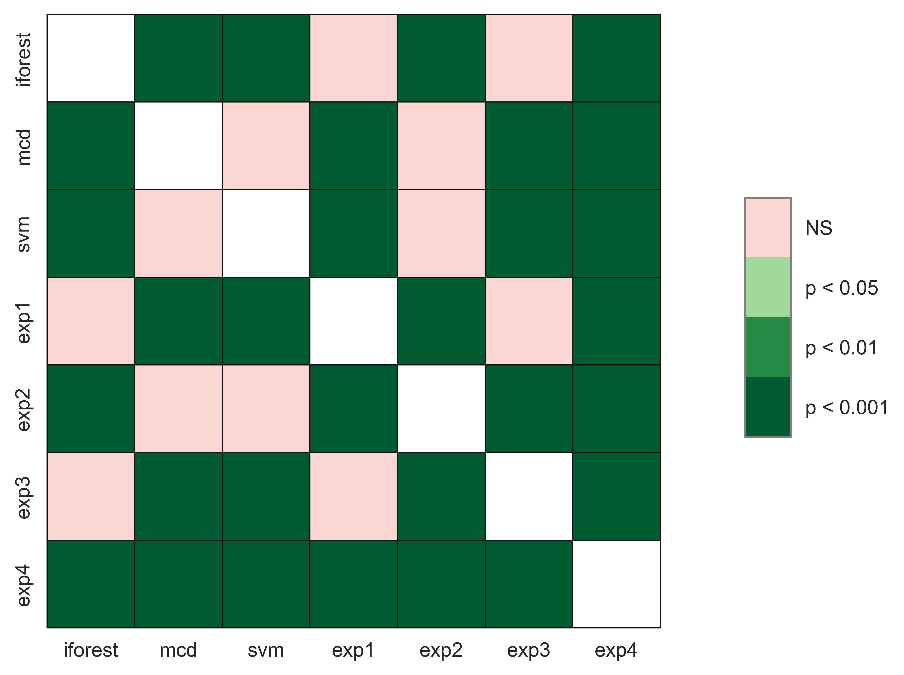
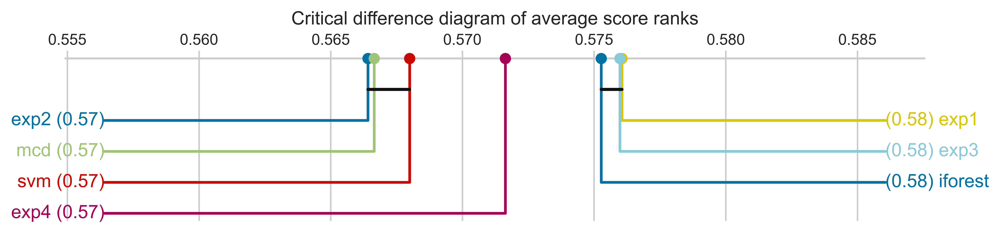

# Conclusion
In summary, Exp-03 consistently obtained the best performance in both datasets. The test dataset was almost six times larger than the train set. It also presented spikes at the beginning and middle of the test. We can observe that the data's size and quality impact the model's choice to detect failures. Models Histogram, Cluster, and KNN were excluded in the test comparison since they accounted for more than 50% of the data when testing the models with the unseen data.

For the test dataset, the __iforest__ model detected the sensor's failure __21:20__ h before the breakdown, and __Exp-01__ and __Exp-03__ detected the failure __1:30__ h earlier than the iforest (22:30 h). The iforest model, Exp-01 and Exp-03, exhibited __no significant difference__ at earlier detection of bearing failures. The iforest model was also more robust to changes in the sample size and the sample itself. Conversely, Exp-04, the top performer on the training dataset, ranked the middle performance on the test dataset. 

We can conclude that the PyCaret Anomalies models selected in this work and the Bilstm (Bidirectional LSTM) Autoencoders can detect failures on the bearing sensors' signal at the same performance level. Whether these models can detect failures days or weeks in advance in unseen data requires further testing and optimisation in unseen data. PyCaret is a reliable choice for unsupervised anomaly detection in time-series data.

## References

[1] [PyCaret](https://pycaret.gitbook.io/docs/)
 
 
[2] https://towardsdatascience.com/lstm-autoencoder-for-anomaly-detection-e1f4f2ee7ccf
 
 
[3] https://towardsdatascience.com/machine-learning-for-anomaly-detection-and-condition-monitoring-d4614e7de770
 
 
[4] https://sabtainahmadml.medium.com/condition-monitoring-through-diagnosis-of-anomalies-lstm-based-unsupervised-ml-approach-5f0565735dff
 
 
[5] Zhang, R.; Peng, Z.; Wu, L.; Yao, B.; Guan, Y. Fault Diagnosis from Raw Sensor Data Using Deep Neural Networks Considering Temporal Coherence. Sensors 2017, 17, 549. https://doi.org/10.3390/s1703054
 
 
[6] Goldstein, M. and Uchida, S. (2016) ‘A comparative evaluation of unsupervised anomaly detection algorithms for multivariate data’, PLOS ONE, 11(4). doi:10.1371/journal.pone.0152173. 
 
 
[7] K. Choi, J. Yi, C. Park and S. Yoon, "Deep Learning for Anomaly Detection in Time-Series Data: Review, Analysis, and Guidelines," in IEEE Access, vol. 9, pp. 120043-120065, 2021, doi: 10.1109/ACCESS.2021.3107975.

